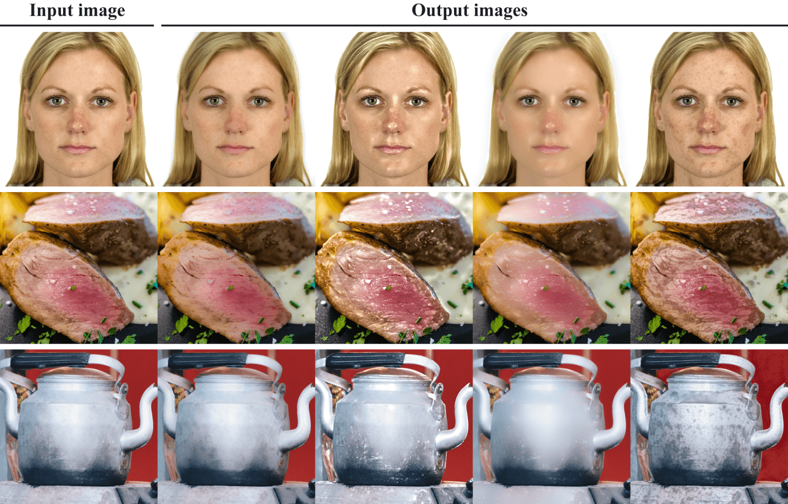
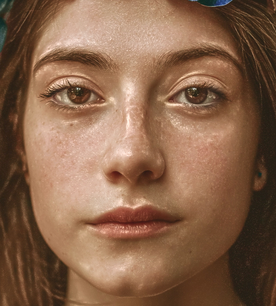
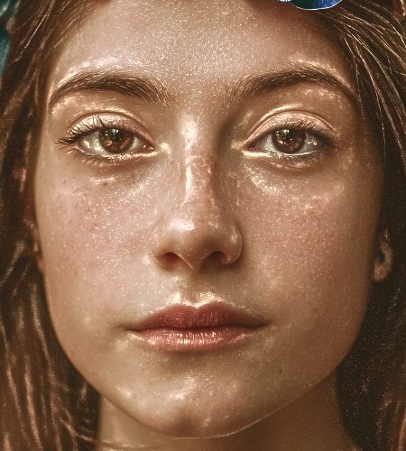
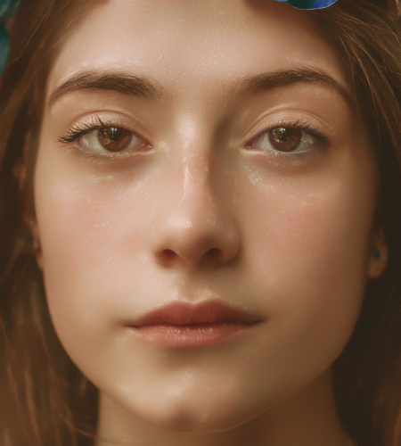
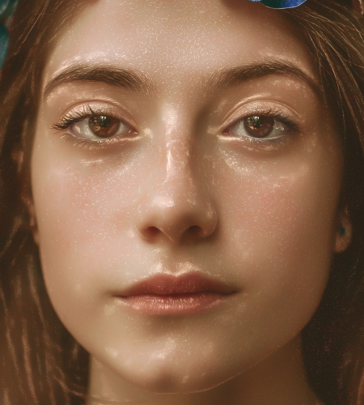
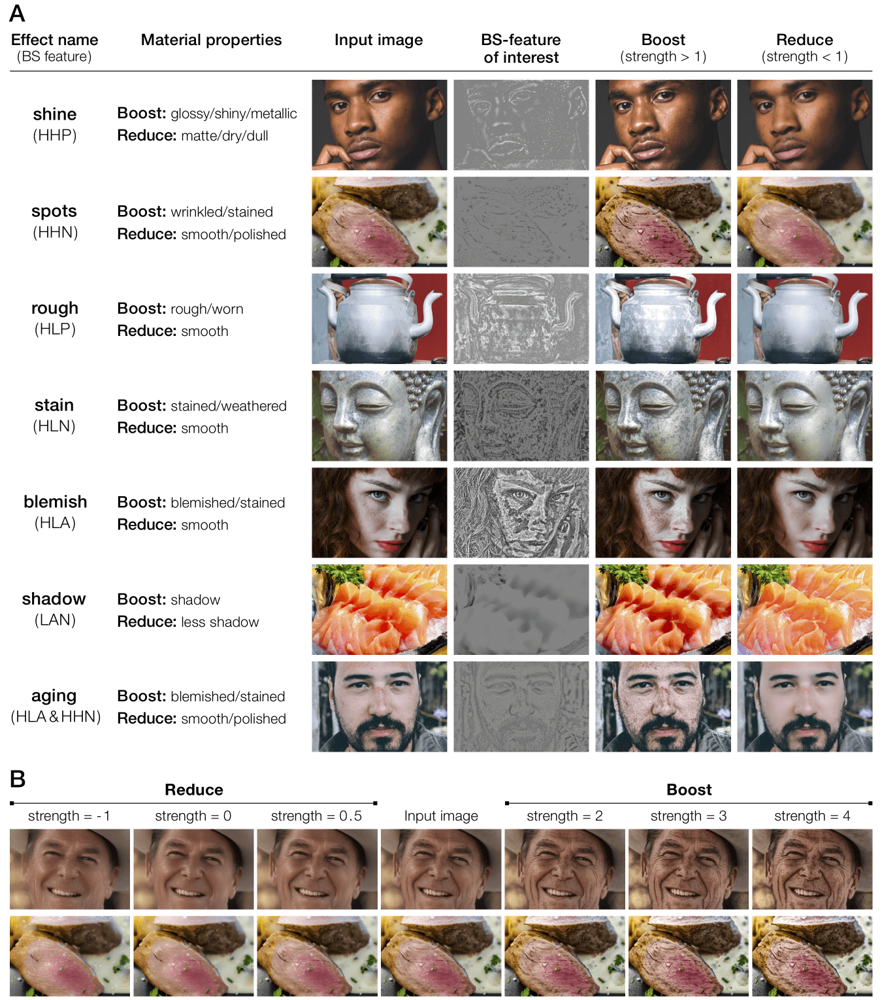
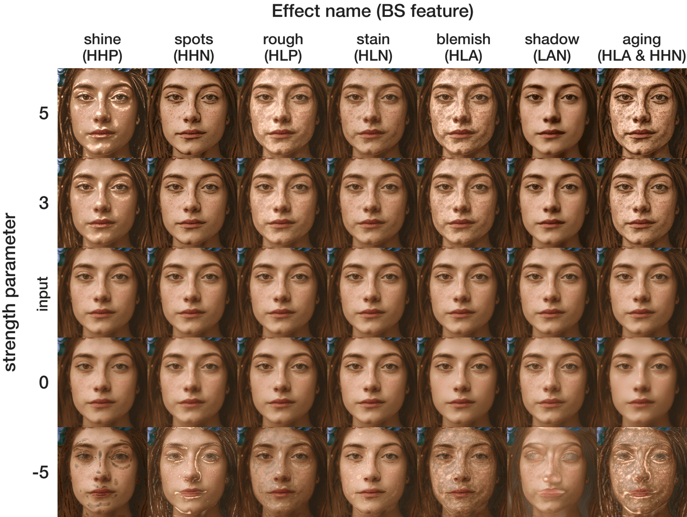
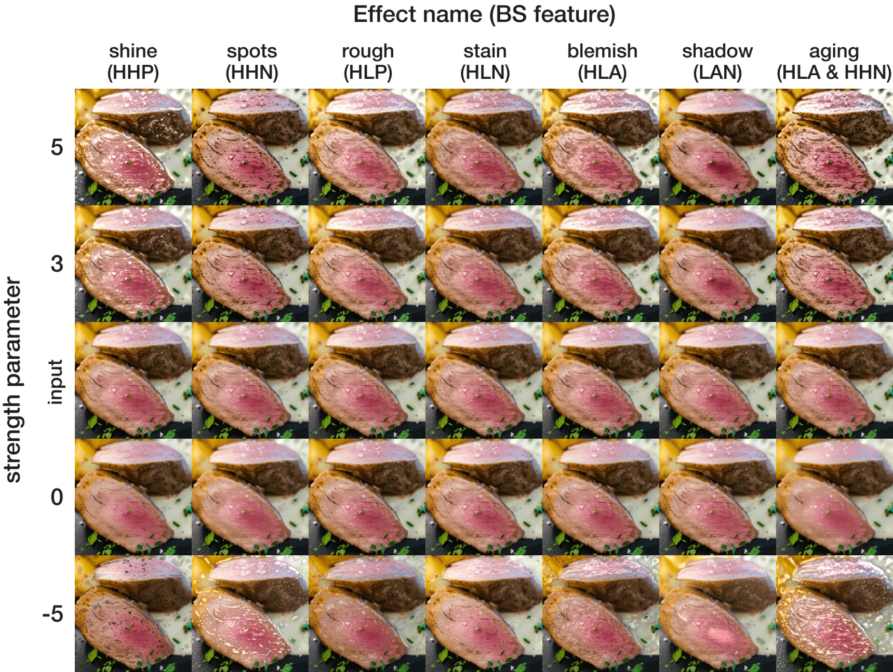
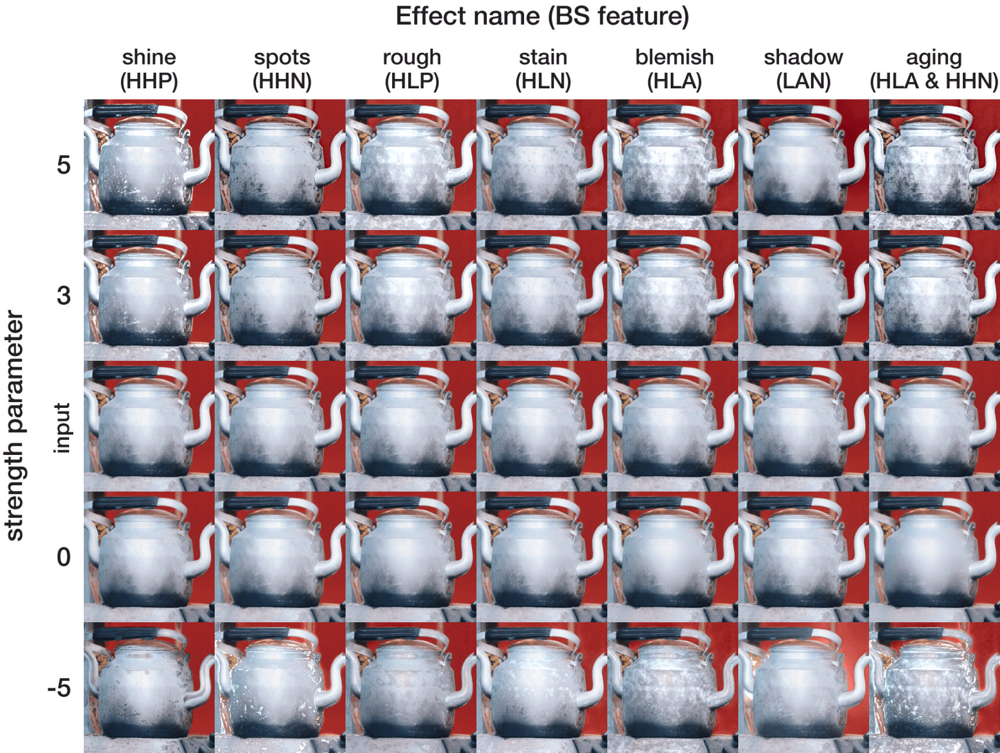

<!-- README.md is generated from README.Rmd. Please edit that file -->

```{r, include = FALSE}
knitr::opts_chunk$set(
  collapse = TRUE,
  comment = "#>",
  fig.path = "notes/figures/",
  out.width = "100%",
  dpi=130
)
```

# materialmodifier

<!-- badges: start -->
[](https://cran.r-project.org/package=materialmodifier)
[](https://cran.r-project.org/package=materialmodifier)
[](https://cran.r-project.org/package=materialmodifier)
[](https://cran.r-project.org/package=materialmodifier)
[](https://choosealicense.com/licenses/mit/)
<!-- badges: end -->

This is an R package that is used for applying image-based material editing effects. The user can edit the appearance of objects in an image, such as enhancing the gloss of fruits and removing the blemishes of facial skin.

<p></p>

## Paper

Details of this package (e.g. image processing algorithm) will be described in the article below:

Tsuda and Kawabata (under review). materialmodifier: an R package for image-based material editing.

## Dependencies

Mac users need to install XQuartz (https://www.xquartz.org/).

## Installation

#### Installation via CRAN

The package is available on CRAN. It can be installed with:

```{r, eval=FALSE, echo=TRUE}
install.packages("materialmodifier")
```

Then, attach the package.

```{r, eval=FALSE, echo=TRUE}
library(materialmodifier)
```

#### Installation via GitHub

You can install the development version of the ```materialmodifier``` package via GitHub, by using the ```devtools``` package.

```{r, eval=FALSE, echo=TRUE}
# install the devtools package
install.packages("devtools")
```

__NOTE:__  
To install a package from GitHub,  
- On Windows, <a href="https://cran.r-project.org/bin/windows/Rtools/">Rtools</a> needs to be installed.  
- On Mac, in some environments, the installation of XCode may be needed.

After you have installed the required software stated above, install the package as follows:

``` r
# install the materialmodifier package
devtools::install_github("tsuda16k/materialmodifier")
```

Then, attach the package.

```{r}
library(materialmodifier)
```

## Example image

The ```materialmodifier``` package includes an image data, which is useful when you want to try material editing effects right away. The variable name of the image is ```face```.

Internally, this is just a numeric array of size 500 x 450 x 3 [y-coordinate, x-coordinate, color channel], meaning that it is 500 pix height and 450 pix width, and has three color channels (Red, Green, and Blue). Each element of the array represents a pixel value, which can range between 0 and 1.

```{r}
dim(face)
```

Image size information can be shown by typing the variable name.

```{r}
face
```

To plot an image, use the ```plot()``` function.

```{r, eval=FALSE, echo=TRUE}
plot(face)
```


## Load an image

To load an image you like, use the ```im_load()``` function.

```{r, eval=FALSE, echo=TRUE}
im = im_load("path/to/your/image.jpg")
plot(im)
```

The jpg, png, and bmp formats are supported.

You can load an image from the web (URL). For example, 

```{r, eval=FALSE, echo=TRUE}
im = im_load("https://raw.githubusercontent.com/tsuda16k/materialmodifier/master/notes/meat.png")
plot(im)
```

will load an image of roasted meat.


## Apply material editing effects

The built-in face image is used in the following examples.  
For consistency purposes, the ```face``` image is labeled as ```im```.

```{r}
im = face
```

Use the ```modif()``` function to apply a material editing effect to an image.  
(Note: the function name is ```modif```, not ```modify```)

Below is an example of the ```shine``` effect.

```{r, eval=FALSE, echo=TRUE}
# apply the shine effect
im2 = modif(im, effect = "shine", strength = 2.5) # may take some seconds
plot(im2) # see the result
```

<p> </p>

On the left is the input image, and on the right is the result of the ```shine``` effect.

The ```strength``` parameter is used to control the strength of effects. Larger values of ```strength``` give stronger effects: 

<p></p>

The ```strength``` parameter is (from left to right) 0.1, 1, 2, 3, and 4.

Note that when the ```strength``` parameter is 1, the ```modif()``` function just returns the input image. Therefore the second image from the left is the same as the input image.

When the ```strength``` parameter is between 0 and 1, the output image becomes less shiny than the original (see the leftmost image above).

## Another example

Below is an example of the ```aging``` effect.

```{r, eval=FALSE, echo=TRUE}
# load the face image
im = im_load("https://raw.githubusercontent.com/tsuda16k/materialmodifier/master/notes/meat.png")
# apply the aging effect
im2 = modif(im, "aging", 0.1)
im3 = modif(im, "aging", 2.5)
# show the results
plot(im2)
plot(im)
plot(im3)
```

<p>  </p>

Compared to the original (center), skin blemishes are reduced on the left and boosted on the right.

## Applying multiple effects at the same time

You can apply multiple effects at the same time. To do so, set a vector instead of a scalar to the ```effect``` and  ```strength``` parameters.

The below is an example of applying the ```shine``` and ```aging``` effects simultaneously.

```{r, eval=FALSE, echo=TRUE}
# Applying effects simultaneously
im2 = modif(im, effect = c("shine", "aging"), strength = c(2, 0.2))
plot(im2) # shinier and less blemished
```

<p></p>

Applying each effect in sequence usually produces almost identical results.

```{r, eval=FALSE, echo=TRUE}
# Applying effects simultaneously
im2 = modif(im, effect = c("shine", "aging"), strength = c(2, 0.2))

# Applying effects in sequence
im3 = modif(im, effect = "shine", strength = 2)
im3 = modif(im3, effect = "aging", strength = 0.2)

# pixel-wise mean squared error
mean((im2-im3)^2) # this value is very small, meaning that both images are almost identical
```

When you apply multiple effects to an image, it is recommended to use the single-line approach, rather than applying each effect in sequence, because the former approach is faster.

## List of material editing effects

The ```effect``` parameter of the ```modif()``` function is either "gloss", "shine", "spots", "blemish", "rough", "stain", "shadow", or "aging".

The image below illustrates representative outputs of each effect  
(A) List of effects  
(B) Results of the aging effect for various levels of the strength parameter

<p></p>

## Effect of parameters: in more detail

I would like to present complete sets of outputs derived from a combination of ```effect``` and ```strength``` parameters.

<p></p>

<p></p>

<p></p>

Note that although setting a negative value to the ```strength``` parameter produces weird results in most cases (see the bottom row in each figure), doing so is sometimes useful to find the region that was changed by the ```modif()``` function.

For example, the ```rough``` and ```blemish``` effects appear to produce similar results, but by comparing the outputs of setting a negative value to the strength parameter (the bottom row in each figure), we can see both effects are not identical. Technically, the ```blemish``` effect is equivalent to applying both ```rough``` and ```stain``` effects simultaneously, because HLA (blemish) = HLP (rough) + HLN (stain) (see our paper for details about this notation).

## The modif2() function

The ```modif2()``` function allows for a precise control over which image component(s) to manipulate. For example, boosting the ```LAA``` feature (low spatial frequency, all (high and low) amplitudes, and all (positive and negative) signs) can be performed as follows.

```{r, eval=FALSE, echo=TRUE}
# modify the LAA feature
im2 = modif2(im, params = list(freq = "L", amp = "A", sign = "A", strength = 2 ))
im2 = modif2(im, params = list(feature = "LAA", strength = 2 )) # equivalent to the above
```

Details about image manipulation features (BS features) are described in our paper.

Here are additional examples for using the ```modif2()``` function.

```{r, eval=FALSE, echo=TRUE}
# shine effect (boost the HHP feature)
shine = list(freq = "H", amp = "H", sign = "P", strength = 2)
plot(modif2(face, params = shine))

# shine effect (equivalent to the above)
shine2 = list(freq = 1:4, amp = "H", sign = "P", strength = 2)
plot(modif2(face, params = shine2))

# you can specify a feature name directly, instead of specifying freq/amp/sign separately
plot( modif2(face, params = list(feature = "HHA", strength = 2)) )
plot( modif2(face, params = list(feature = "1HP", strength = 3)) )

# apply multiple effects at the same time
blemish = list(feature = "HLA", strength = 0.1) # less blemished
smooth  = list(feature = "HHN", strength = 0.2) # smoother
plot(modif2(face, params = list(blemish, smooth)))
```

## Parameters of the modif() function

The ```modif()``` function has 6 arguments.

```{r, eval=FALSE, echo=TRUE}
modif(im, effect, strength, max_size = 1024, log_epsilon = 0.0001, filter_epsilon = 0.01)
```

Table of arguments of the ```modif()``` function:

```{r echo = F, results = 'asis'}
Argument = c("im", "effect", "strength", "max_size", "log_epsilon", "filter_epsilon")
Meaning = c( "Input image", "Effect name", "Strength of effect",
             "Image resolution limit", "Offset for log transformation", "Epsilon parameter of the Guided filter" )
Value = c( "an image object", 'Either "gloss", "shine", "spots", "blemish", "rough", "stain", "shadow", or "aging"', "a float value or a float vector", "an integer", "a float value", "a float value" )
Default = c( "", "", "", "1024", "0.0001", "0.01" )
doc_sketch = data.frame( Argument, Meaning, Value, Default, stringsAsFactors = F )
library(knitr)
kable(doc_sketch)
```

The ```im``` is an image object we can get by using the ```im_load()``` function.  
The ```effect``` and ```strength``` parameters have been described above.

The ```max_size``` parameter can be used to restrict the image resolution. If the shorter side of the input image is larger than this value (the default is 1024), input image is resized before applying effects. For example, when the input image has 1024px x 2048px resolution, and if ```max_size``` is 512, then the input image is first resized to 512px x 1024px. 
Because the modif() function is very slow for large-resolution images, it is useful to limit the image resolution to speed up the image processing.

The ```log_epsilon``` and ```filter_epsilon``` are parameters that are used for image processing procedures. You need not to change this value in most cases.

## Parameters of the modif2() function

The ```modif2()``` function has 5 arguments.

```{r, eval=FALSE, echo=TRUE}
modif(im, params, max_size = 1024, log_epsilon = 0.0001, filter_epsilon = 0.01)
```

Table of arguments of the ```modif()``` function:

```{r echo = F, results = 'asis'}
Argument = c("im", "params", "max_size", "log_epsilon", "filter_epsilon")
Meaning = c( "Input image", "A list of parameter values",
             "Image resolution limit", "Offset for log transformation", "Epsilon parameter of the Guided filter" )
Value = c( "an image object", "a list", "an integer", "a float value", "a float value" )
Default = c( "", "", "1024", "0.0001", "0.01" )
doc_sketch = data.frame( Argument, Meaning, Value, Default, stringsAsFactors = F )
library(knitr)
kable(doc_sketch)
```

To the ```params``` parameter, set a list of material editing parameters:

```{r, eval=FALSE, echo=TRUE}
# shine effect (boost the HHP feature)
shine = list(freq = "H", amp = "H", sign = "P", strength = 2)
plot(modif2(face, params = shine))

# shine effect (equivalent to the above)
shine2 = list(freq = 1:4, amp = "H", sign = "P", strength = 2)
plot(modif2(face, params = shine2))

# you can specify a feature name directly, instead of specifying freq/amp/sign separately
plot( modif2(face, params = list(feature = "HHA", strength = 2)) )
plot( modif2(face, params = list(feature = "1HP", strength = 3)) )

# apply multiple effects at the same time
blemish = list(feature = "HLA", strength = 0.1) # less blemished
smooth  = list(feature = "HHN", strength = 0.2) # smoother
plot(modif2(face, params = list(blemish, smooth)))
```

The other parameters are the same as the ```modif()``` function.

## Calculate the BS feature energy

By using the ```get_BS_energy()``` function, we can calculate the BS feature energy information of an image.

```{r}
# calculate the BS feature energy
en = get_BS_energy(face)
en
```

This function calculates the energy of each BS feature (defined as the sum of squared magnitude of a given
BS feature). The total energy (the 9th row) is the sum of the eight BS feature energies.

Each energy is divided by the total energy to give the normalized energy measure.

In addition to the eight BS features, this function also calculates the energy for HLA, LAN, and aging features (10th to 12th rows).
