<!-- README.md is generated from README.Rmd. Please edit that file -->

# materialmodifier

<!-- badges: start -->

[](https://cran.r-project.org/package=materialmodifier)
[](https://cran.r-project.org/package=materialmodifier)
[](https://cran.r-project.org/package=materialmodifier)
[](https://cran.r-project.org/package=materialmodifier)
[](https://choosealicense.com/licenses/mit/)
<!-- badges: end -->

The figure below shows what can be done with this package. The user can
modify the appearance of objects in photographs. For example, they can
make human skin smoother or, conversely, make blemishes more visible.
They can also enhance the gloss of fruit or make it look wilted. Based
on image processing techniques, the user can automatically perform such
photo editing effects by simply calling on a single R function.

<p>
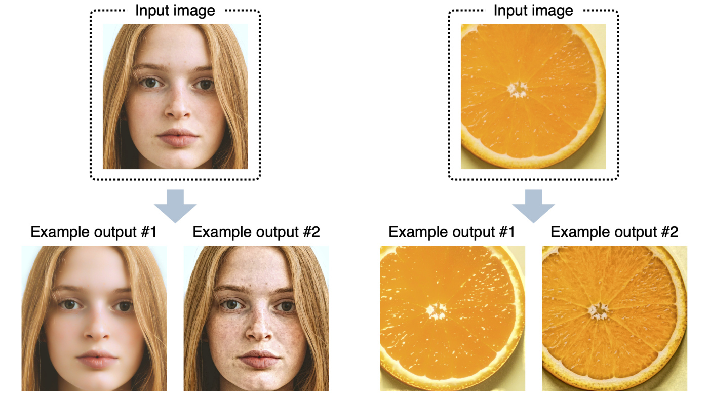
</p>

## Paper

Details of this package (background, algorithm, usage, etc.) will be
described in the article below:

Tsuda and Kawabata (under review). materialmodifier: An R package of
photo editing effects for material perception research.

## Dependencies

Mac users need to install XQuartz (<https://www.xquartz.org/>).

## Installation

#### Installation via CRAN

The package is available on CRAN. It can be installed with:

``` r
install.packages("materialmodifier")
```

Then, attach the package.

``` r
library(materialmodifier)
```

#### Installation via GitHub

You can install the development version of the `materialmodifier`
package via GitHub, by using the `devtools` package.

``` r
# install the devtools package
install.packages("devtools")
```

**NOTE:**  
To install a package from GitHub,  
- On Windows,
<a href="https://cran.r-project.org/bin/windows/Rtools/">Rtools</a>
needs to be installed.  
- On Mac, in some environments, installation of XCode may be needed.

After you have installed the required software stated above, install the
package as follows:

``` r
# install the materialmodifier package
devtools::install_github("tsuda16k/materialmodifier")
```

Then, attach the package.

``` r
library(materialmodifier)
```

## Example image

The `materialmodifier` package contains data for an image, which is
useful when you want to quickly try out a material editing effect. The
variable name for this image is `face`.

Internally, this data is a numeric array with the size 500 x 500 x 3
\[y-coordinate, x-coordinate, color channel\], which means a height of
500 pix, a width of 500 pix, and three color channels (Red, Green, and
Blue). Each element of the array represents a pixel value, which can be
between 0 and 1.

``` r
dim(face)
#> [1] 500 500   3
```

The image size information can be displayed by typing the variable name.

``` r
face
#> image: 500 [height] x 500 [width] x 3 [colour channels]
```

To plot an image, use the `plot()` function.

``` r
plot(face)
```

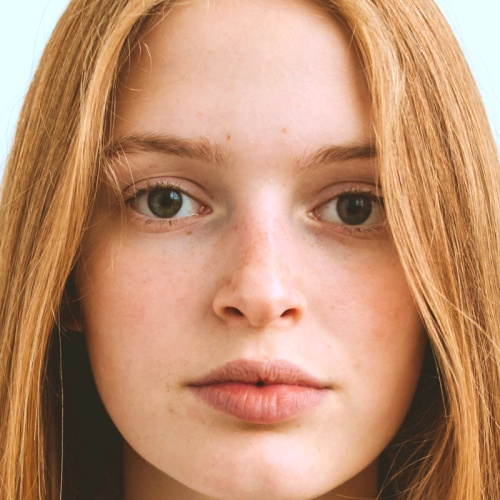

## Load an image

To load an image in your computer, use the `im_load()` function.

``` r
im = im_load("path/to/your/image.jpg")
plot(im)
```

The jpg, png, and bmp formats are supported.

You can load an image from the web (URL). For example,

``` r
im = im_load("https://raw.githubusercontent.com/tsuda16k/materialmodifier/master/notes/meat.png")
plot(im)
```

will load an image of roasted meat.


## Apply material editing effects

In the following example, we use the face image contained in the
package.  
For consistency purposes, the `face` image is labeled as `im`.

``` r
im = face
```

Use the `modif()` function to apply a material editing effect to an
image.  
(Note: the function name is `modif`, not `modify`)

Below is an example of the `shine` effect.

``` r
# apply the shine effect
im2 = modif(im, effect = "shine", strength = 3.0) # may take some seconds
plot(im2) # see the result
```

<p>

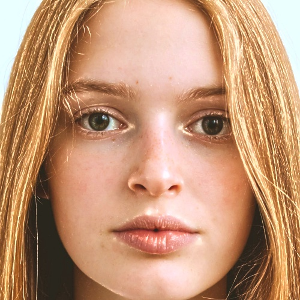
</p>

On the left is the input image, and on the right is the result of the
`shine` effect.

The `strength` parameter is used to control the strength of the image
processing effect. A larger value of `strength` will produce a stronger
effect:

<p>
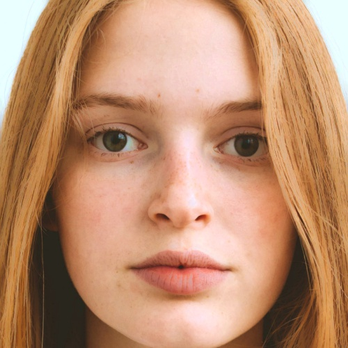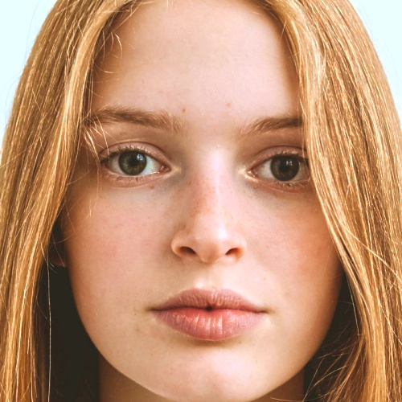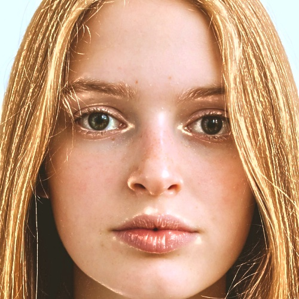
</p>

The `strength` parameters, from left to right, are 0.1, 1, 2, 3, and 4.

Note that when the `strength` parameter is 1, the `modif()` function
just returns the input image. Therefore the second image from the left
is the same as the input image.

When the `strength` parameter is between 0 and 1, the output image
becomes less shiny than the original (see the leftmost image above).

## Another example

Below is an example of the `aging` effect.

``` r
# load the face image
im = im_load("https://raw.githubusercontent.com/tsuda16k/materialmodifier/master/notes/face.jpg")
# apply the aging effect
im2 = modif(im, "aging", 0.1)
im3 = modif(im, "aging", 2.5)
# show the results
plot(im2)
plot(im)
plot(im3)
```

<p>
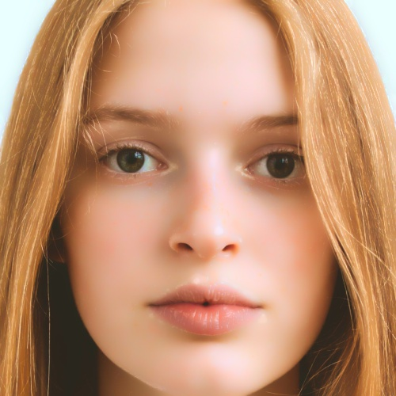

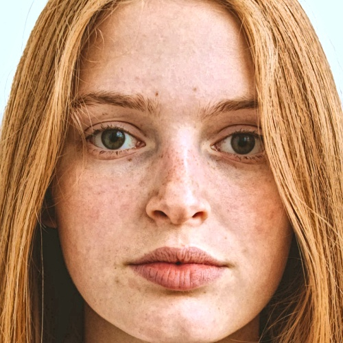
</p>

Compared to the original (center), skin blemishes are reduced on the
left and boosted on the right.

The figure below summarizes outputs of the shine and aging effects.

<p>
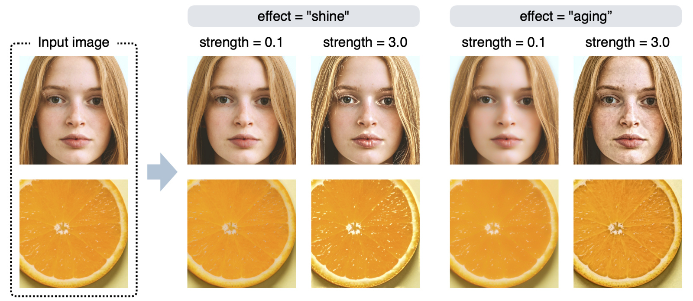
</p>

## The strength parameter

Using the aging effect as an example, the effect of the strength
parameter is examined in more detail in the figure below. If the value
of the strength parameter is greater than 1, a boosting effect that
increases the stains/blemishes occurs; if it is less than 1, a reducing
effect that decreases the stains/blemishes occurs.

<p>
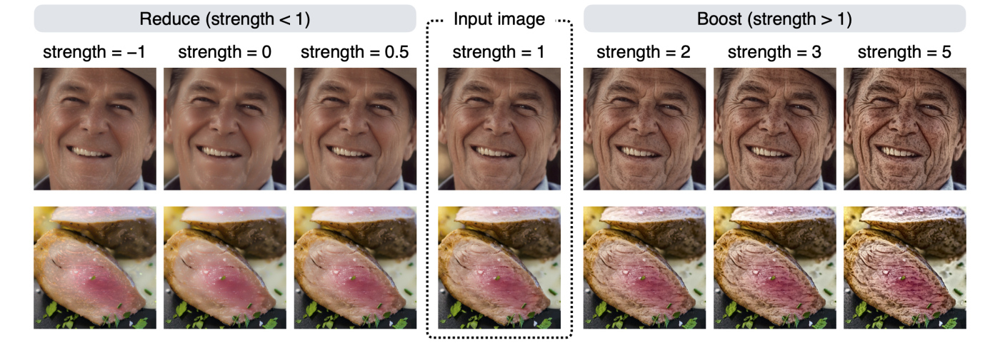
</p>

To get a boosting effect, a strength value of 2 to 6 usually yields
reasonable results. The strength parameter can be a negative value, but
in most cases setting a negative value will produce unrealistic results
(e.g., contrast reversal)

## The effect parameter

This package has several other effects in addition to the shine and
aging effects. All available effects are: shine, spots, rough, stain,
blemish, shadow, aging. A visual summary of these effects is shown in
the figure below.

<p>
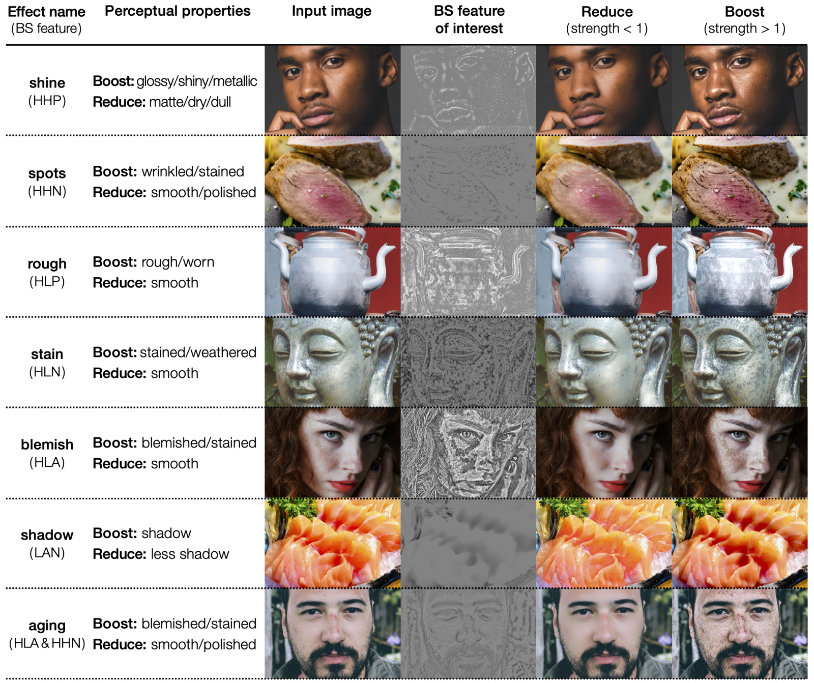
</p>

The first column of the figure shows the name of each effect, and the
second column shows the perceptual features controlled by that effect.
The third and subsequent columns show the input and output images.

The figure contains a column called BS feature. The BS feature is an
important term related to the image processing algorithm (briefly, the
image area to be manipulated, extracted from the input image based on a
certain criterion). The algorithm achieves image editing effects by
decreasing or increasing the weight of the BS feature in the input
image.

## Summary of image processing results with different strength values for each effect

To better understand the nature of each image editing effect, it is
helpful to compare the results of all editing effects on a single image.
The figure below summarizes the results of the editing effects on a face
and a food image (note that the image in the row with a strength value
of 1 is the input image). By comparing the images in the rows with large
values of the strength parameter, it is easier to see the
characteristics of each effect.

<p>
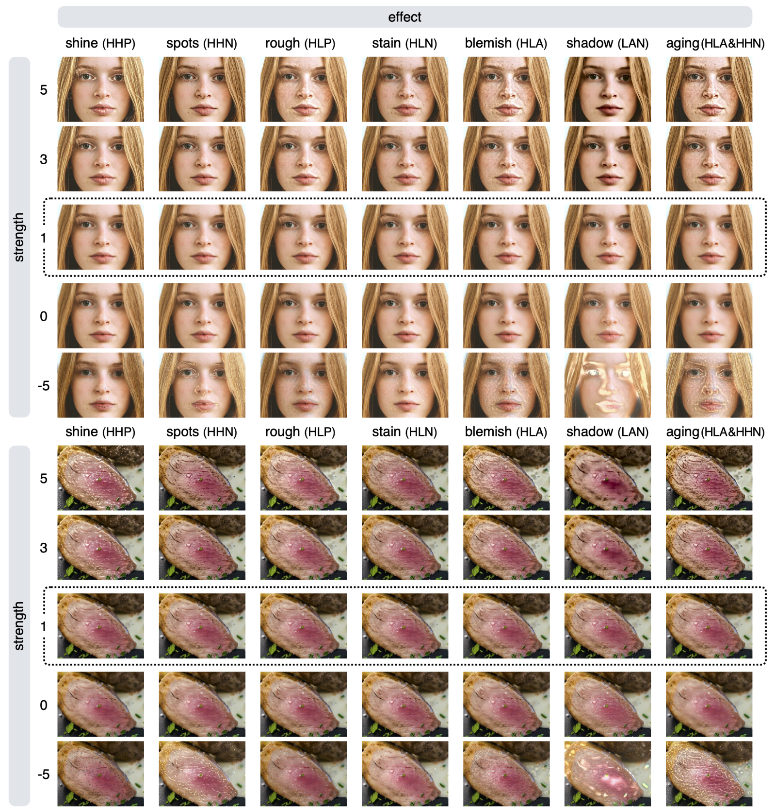
</p>

Setting a negative value for the strength parameter often results in an
unnatural image (see images in the bottom rows of the figure), but using
a large negative value for the strength parameter makes it easier to
compare which areas are affected by each effect. For example, the rough
effect and the blemish effect produce similar results, but if you
compare the images in the row with a strength value of -5, you can
clearly see that they are not identical.

Technically, the blemish effect is equivalent to giving both the rough
and stain effects at the same time. In order to get a more formal
understanding of these properties, we need to know more about the
specifics of how image processing algorithms work. See our paper for
details.

## Applying multiple effects at the same time

You can also perform multiple editing effects at the same time. For
example, you can apply the shine effect and the aging effect at the same
time as follows.

``` r
# Applying multiple effects at the same time
im2 = modif(im, effect = c("shine", "aging"), strength = c(0.2, 3))
plot(im2)
```

<p>
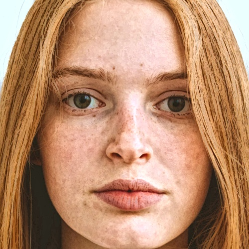
</p>

The above command simultaneously applies a shine effect of strength =
0.2 and an aging effect of strength = 3, resulting in a less shiny and
more blemished image.

Applying each effect in sequence produces almost identical results.

``` r
# Applying multiple effects at the same time
im2 = modif(im, effect = c("shine", "aging"), strength = c(0.2, 3))

# Applying effects in sequence
im3 = modif(im, effect = "shine", strength = 0.2)
im3 = modif(im3, effect = "aging", strength = 3)

# pixel-wise mean squared error
mean((im2-im3)^2)
# this value is very small, meaning that both images are almost identical
```

Although you can get the same result by applying each effect in turn
(e.g., applying an aging effect to the output of a shine effect), we
recommend doing them in a single line, because it saves time needed for
image processing.

## The modif2() function

The `modif2()` function allows for a precise control over which image
feature (i.e., BE feature) to manipulate. For example, boosting the
`LAA` feature (low spatial frequency, all (high and low) amplitudes, and
all (positive and negative) signs) can be performed as follows.

``` r
# modify the LAA feature
im2 = modif2(im, params = list(freq = "L", amp = "A", sign = "A", strength = 2 ))
im2 = modif2(im, params = list(feature = "LAA", strength = 2 )) # equivalent to the above
```

Details about image manipulation features (BS features) are described in
our paper.

Here are additional examples for using the `modif2()` function.

``` r
# shine effect (boost the HHP feature)
shine = list(freq = "H", amp = "H", sign = "P", strength = 2)
plot(modif2(face, params = shine))

# shine effect (equivalent to the above)
shine2 = list(freq = modif_dim(face)$high, amp = "H", sign = "P", strength = 2)
plot(modif2(face, params = shine2))

# you can specify a feature name directly, instead of specifying freq/amp/sign separately
plot( modif2(face, params = list(feature = "HHA", strength = 2)) )
plot( modif2(face, params = list(feature = "1HP", strength = 3)) )

# apply multiple effects at the same time
blemish = list(feature = "HLA", strength = 0.1) # less blemished
smooth  = list(feature = "HHN", strength = 0.2) # smoother
plot(modif2(face, params = list(blemish, smooth)))
```

## Parameters of the modif() function

The `modif()` function has 6 arguments.

``` r
modif(im, effect, strength, max_size = 1280, log_epsilon = 0.0001, filter_epsilon = 0.01)
```

Table of arguments of the `modif()` function:

| Argument        | Meaning                                | Value                                                                               | Default |
|:----------------|:---------------------------------------|:------------------------------------------------------------------------------------|:--------|
| im              | Input image                            | an image object                                                                     |         |
| effect          | Effect name                            | Either “gloss”, “shine”, “spots”, “blemish”, “rough”, “stain”, “shadow”, or “aging” |         |
| strength        | Strength of effect                     | a float value or a float vector                                                     |         |
| max\_size       | Image resolution limit                 | an integer                                                                          | 1280    |
| log\_epsilon    | Offset for log transformation          | a float value                                                                       | 0.0001  |
| filter\_epsilon | Epsilon parameter of the Guided filter | a float value                                                                       | 0.01    |

The `im` is an image object we can get by using the `im_load()`
function.  
The `effect` and `strength` parameters have been described above.

The `max_size` parameter can be used to restrict the image resolution.
If the shorter side of the input image is larger than this value (the
default is 1280), input image is resized before applying effects. For
example, when the input image has 1024 x 2048 px resolution, and if
`max_size` is 512, then the input image is first resized to 512 x 1024
px. Because the modif() function is very slow for large-resolution
images, it is useful to limit the image resolution to speed up the image
processing.

The `log_epsilon` and `filter_epsilon` are parameters that are used for
image processing procedures. You need not change this value in most
cases.

## Parameters of the modif2() function

The `modif2()` function has 5 arguments.

``` r
modif(im, params, max_size = 1280, log_epsilon = 0.0001, filter_epsilon = 0.01)
```

Table of arguments of the `modif()` function:

| Argument        | Meaning                                | Value           | Default |
|:----------------|:---------------------------------------|:----------------|:--------|
| im              | Input image                            | an image object |         |
| params          | A list of parameter values             | a list          |         |
| max\_size       | Image resolution limit                 | an integer      | 1280    |
| log\_epsilon    | Offset for log transformation          | a float value   | 0.0001  |
| filter\_epsilon | Epsilon parameter of the Guided filter | a float value   | 0.01    |

For the `params` parameter, set a list of material editing parameters:

``` r
# shine effect (boost the HHP feature)
shine = list(freq = "H", amp = "H", sign = "P", strength = 2)
plot(modif2(face, params = shine))

# shine effect (equivalent to the above)
shine2 = list(freq = modif_dim(face)$high, amp = "H", sign = "P", strength = 2)
plot(modif2(face, params = shine2))

# you can specify a feature name directly, instead of specifying freq/amp/sign separately
plot( modif2(face, params = list(feature = "HHA", strength = 2)) )
plot( modif2(face, params = list(feature = "1HP", strength = 3)) )

# apply multiple effects at the same time
blemish = list(feature = "HLA", strength = 0.1) # less blemished
smooth  = list(feature = "HHN", strength = 0.2) # smoother
plot(modif2(face, params = list(blemish, smooth)))
```

The other parameters are the same as the `modif()` function.

## Calculation of BS feature energy

The `get_BS_energy()` function can be used to calculate the energy of
each BS feature in an image. The energy of a BS feature is defined as
the sum of its squared luminance: All the pixel values of a specific BS
feature image are squared and then summed.

``` r
get_BS_energy(face)
#>    feature       energy normalized
#> 1      HHP 0.0015346350 0.08824827
#> 2      HHN 0.0022643348 0.13020923
#> 3      HLP 0.0002463833 0.01416813
#> 4      HLN 0.0001806730 0.01038950
#> 5      LHP 0.0025246800 0.14518023
#> 6      LHN 0.0078669494 0.45238425
#> 7      LLP 0.0017787148 0.10228394
#> 8      LLN 0.0009936014 0.05713646
#> 9    total 0.0173899717 1.00000000
#> 10     HLA 0.0003665031 0.02107554
#> 11     LAN 0.0104811699 0.60271345
#> 12   aging 0.0028296759 0.16271883
```

The output of the `get_BS_energy()` function is a data frame, which has
the energy values of eight BS features (rows 1-8) and the total energy
(sum of the above eight, row 9). In addition, it has the energy values
of composite features (HLA, LAN, aging) of multiple BS features. The
`normalized` column is obtained by dividing each energy value by the
total energy value.
